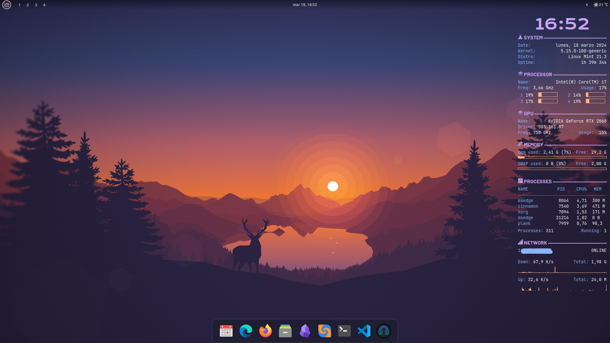
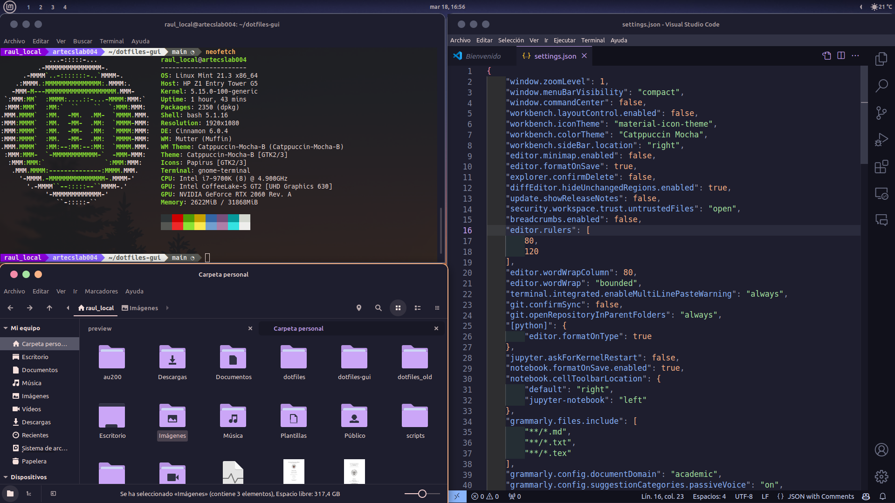

# dotfiles-gui

This repository contains the files and scripts for fancy customization of a graphical environment based on **Linux Mint (Cinnamon desktop)**. The visual modifications made using these files are performed only on the user environment, so the system remains unmodified.



Even with multiple monitors:


The beauty is that all the customization is done by the scripts themselves so that (practically) no user interaction is required.

You can even run this script directly on a fresh install!

## Quick setup

To reproduce my system, just run these three lines of code:
```bash
git clone https://github.com/RaulMurillo/dotfiles-gui.git
cd dotfiles-gui
./go.sh
```
When the installation is complete, you must log out of the session.

> [!Important]  
> To install the required packages, you will need root privileges. It will install also the required dependencies.   
> However, you can still do some customizations without modifying the system. Just select the "no" option when prompted.




## Additional adjustments

- If you use a language different from English or Spanish, modify [the `IMGDIR` variable](desktop_setup.sh#L87).
- If your system has a dedicated GPU, you may want to take a look at the [Conky configuration](conky/panel/conkyrc.conf#160).
- Similarly, modify Conky according to the [model](conky/panel/conkyrc.conf#143) and [number of cores](conky/panel/conkyrc.conf#149) of your CPU.
- To customize the shell prompt and VSCode look and feel, visit my other repo https://github.com/RaulMurillo/dotfiles.
